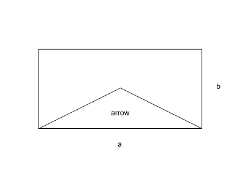

# Area of an arrow

## Task

An arrow is formed in a rectangle with sides `a` and `b` by joining the bottom corners to the midpoint of the top edge and the centre of the rectangle.

`a` and `b` are `integers` and `> 0`

Write a function which returns the area of the arrow.

